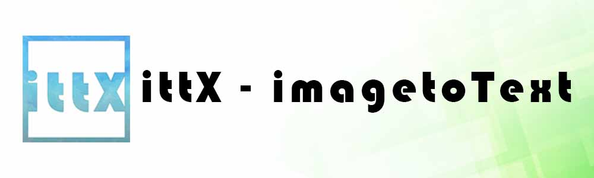
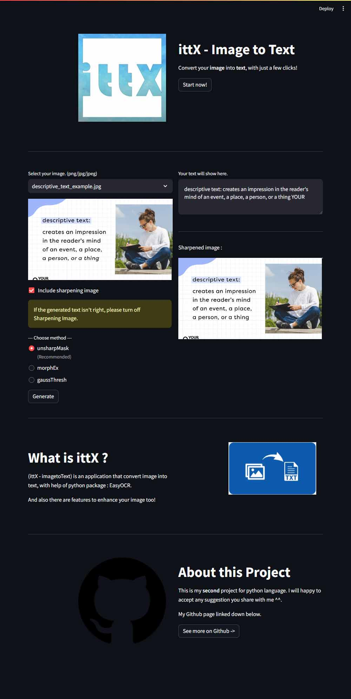

<div align="center">

<h4>Simple image-to-text with additional Image sharpener.<h4>

 [](https://opensource.org/licenses/MIT)

</div>

## What is ittX - imgtoText
ittX is a imagetoText apps that mainly using python for programming language, and also uses EasyOCR to help extracting img data.

## Overview


## Getting Started

1. Download the release from [here](https://github.com/d1azdn/ittX-imgtoText/releases).

2. Download the `requirements.txt`
```sh
pip3 install -r requirements.txt
```

3. Run the code by putting this command on your CLI
```sh
streamlit run main.py
```

4. Done and enjoy

## Note
This apps require TORCH and CUDA for this application can be run, both package requires atleast 2gb's of your data usage.

And thanks to EasyOCR for the main package of this apps. Go check their website [here](https://www.jaided.ai/easyocr/).

## Meta
Diaz Saputra - diazsaputramc@gmail.com
Distributed under the MIT License, see `LICENSE` for more information
[https://github.com/d1azdn/](https://github.com/d1azdn/)

# Clone
Clone this project

```sh
git clone -b [tag-name] https://github.com/d1azdn/ittx-imagetoText
```